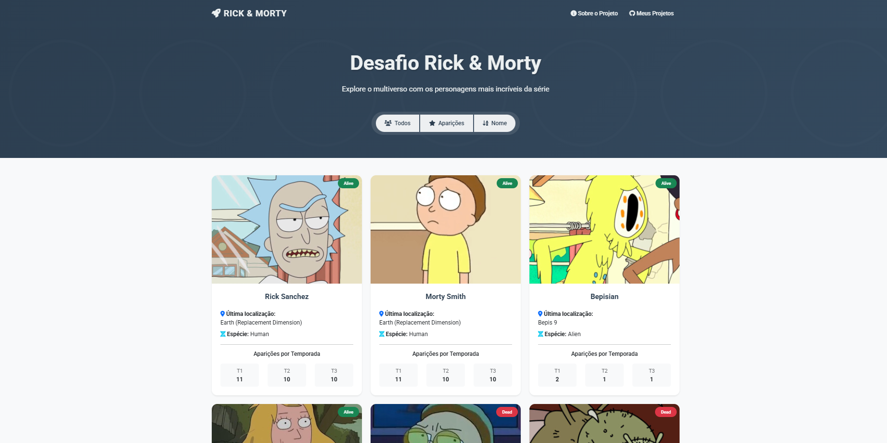

# API: Rick and Morty - Personagens

## Objetivo
Desenvolver uma aplicação web full-stack utilizando **Node.js**, **Express** e **EJS** para exibir de forma dinâmica uma lista dos personagens de *Rick and Morty*. O sistema apresenta informações detalhadas de cada personagem, como nome, gênero, status de vida e quantidade de aparições por temporada, com interface moderna e responsiva.

## Funcionalidades
- Listagem dinâmica dos personagens de Rick and Morty
- Ordenação alfabética e por quantidade de aparições
- Visualização das aparições por temporada
- Interface responsiva e moderna com **Bootstrap 5**
- Separação de estilos em arquivo CSS próprio
- Navegação aprimorada com header moderno e ícones

## Habilidades Demonstradas
- **Lógica de programação**: manipulação de arrays, algoritmos de ordenação e processamento de dados
- **Desenvolvimento full-stack**:
  - Backend: **Node.js** e **Express**
  - Frontend: **HTML**, **EJS**, **Bootstrap 5**, **JavaScript** e **Font Awesome**
- **Boas práticas de organização de código** e separação de responsabilidades (MVC)

## Screenshots
Veja abaixo uma prévia da interface da aplicação:



## O que foi Feito

### Lógica de Programação
- **Ordenação dos personagens:**
  - Por nome (ordem alfabética)
  - Por quantidade de aparições (ordem decrescente)
- **Processamento de episódios:**
  - Função que divide a lista de episódios em inteiros, representando o número de aparições por temporada

### Frontend
- **HTML + EJS (template engine):**
  - Renderização dinâmica dos dados
- **Bootstrap 5:**
  - Interface moderna, responsiva e agradável
- **CSS customizado:**
  - Estilos próprios em `public/css/styles.css` para maior personalização
- **JavaScript:**
  - Manipulação dinâmica dos cards e integração com a API
- **Font Awesome:**
  - Ícones modernos para navegação e informações

### Backend
- **Node.js + Express:**
  - Estrutura do servidor e arquitetura **MVC**
- **Controllers:**
  - Processamento e envio dos dados do arquivo `characters.json` para a view

## Como Executar
1. Instale as dependências:
   ```bash
   npm install
   ```
2. Inicie o servidor:
   ```bash
   npm start
   ```
3. Acesse no navegador:
   ```
   http://localhost:5000
   ```

## Conclusão
Este projeto permitiu aplicar conceitos de **ordenação**, **MVC** e **desenvolvimento full-stack**, além de proporcionar experiência prática com estilização moderna e responsiva. O resultado é uma aplicação funcional, bonita e de fácil navegação, consolidando habilidades essenciais para o desenvolvimento web.
